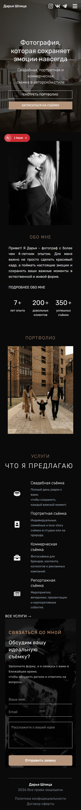
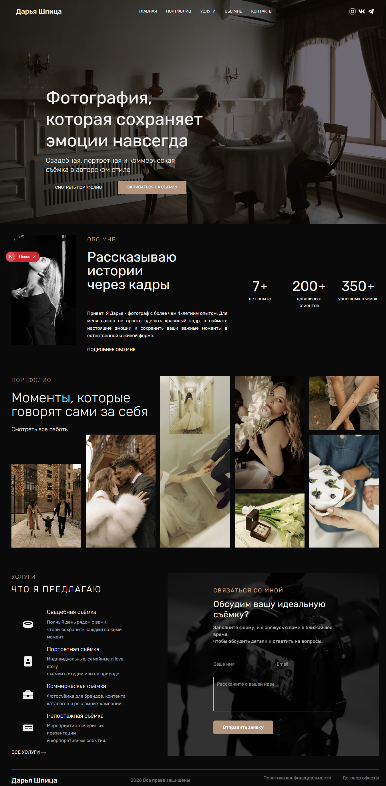

# photosite

Простой сайт-портфолио.

## Стек
- Next.js (app-router)
- React + TypeScript
- Tailwind CSS (утилиты в разметке)
- PostCSS
- Настройка через next.config.ts, tsconfig.json

## Что использовано
- Компоненты в src/app (Header, Footer, Main и т.д.)
- Статические изображения в public/images
- Tailwind-классы для стилизации

## Установка и запуск (локально)
Открыть терминал в корне проекта (Windows):
- Установить зависимости:
  - npm install
- Запустить режим разработки:
  - npm run dev
- Собрать продакшн-билд:
  - npm run build
- Запустить продакшн-сервер локально:
  - npm start

(Если используете yarn: замените команды на yarn / yarn dev / yarn build / yarn start)

## Переменные окружения
- В текущей версии явных переменных окружения не требуется. Если добавите — используйте .env.local

## Публичные файлы
- Положите дополнительные изображения в `public/images` и используйте через `/images/...`

## Скриншоты

  
Скриншоты проекта

  ### Mobile
  

  ### Desktop
  

## Примечания
- Код организован в папке `src/app`. Компоненты находятся в соответствующих подпапках.
- Tailwind-интеграция ожидает конфигурации в проекте (postcss.config.mjs и tailwind.config.*).
